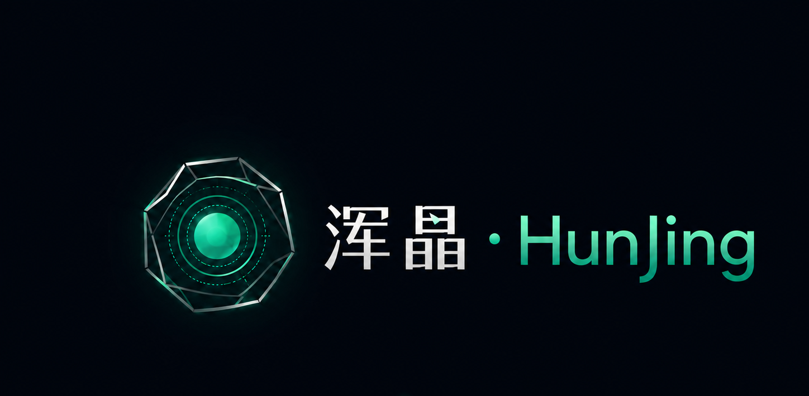
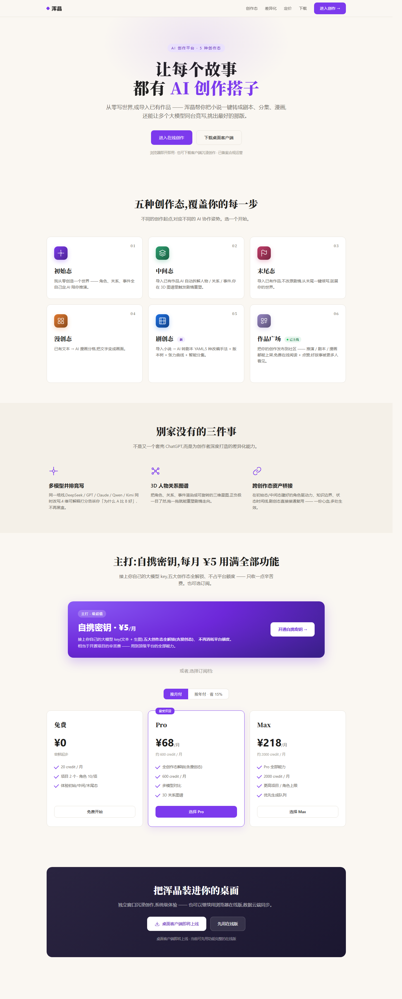
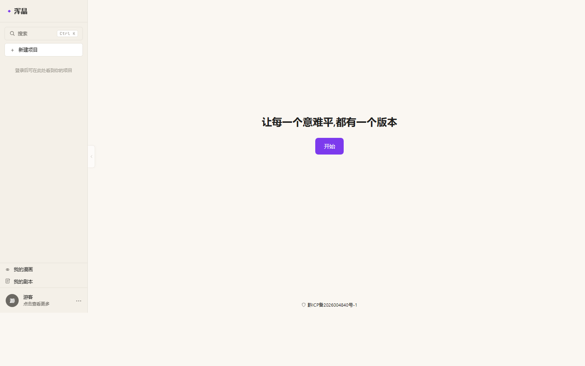
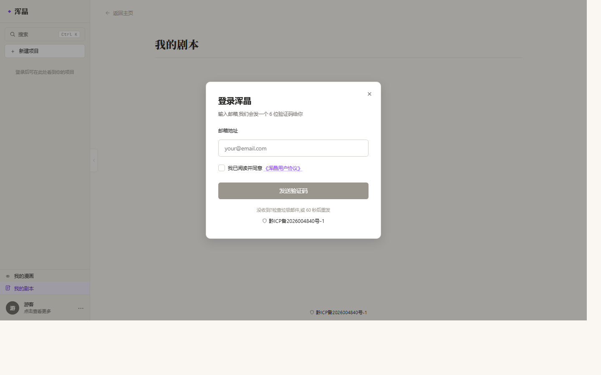
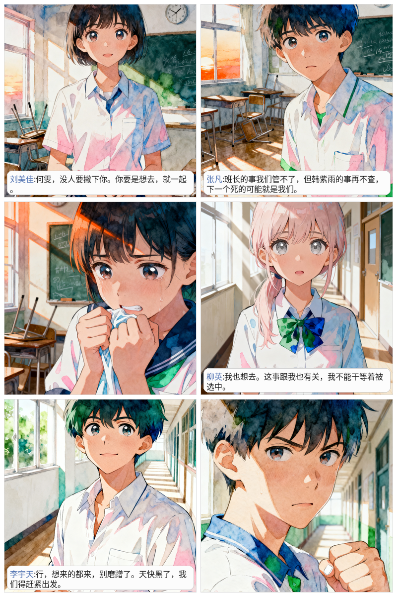
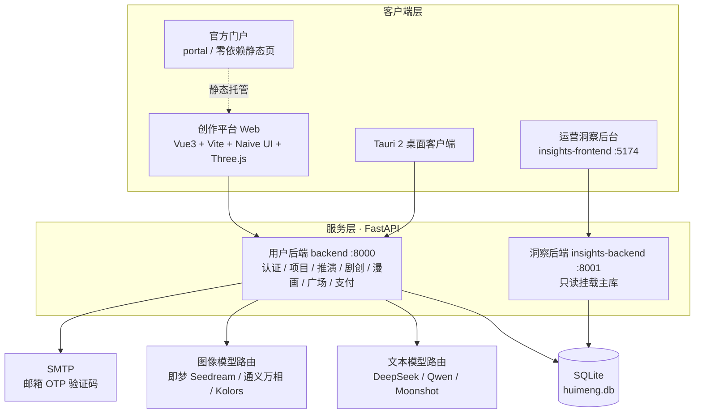

<p align="center">
  
</p>

<h1 align="center">浑晶 · HunJing</h1>

<p align="center">
  <b>让每一个意难平，都有一个版本。</b><br>
  AI 多态创作平台 —— 小说续写 · 反事实推演 · 小说转剧本 · AI 漫画 · 作品社区
</p>

<p align="center">
  
  
  
  
  
  
</p>

<p align="center">
  <a href="https://shuangdayeye.cn"><b>🌐 在线体验</b></a> &nbsp;·&nbsp;
  <a href="#-快速开始"><b>🛠 本地运行</b></a> &nbsp;·&nbsp;
  <a href="https://github.com/LaL-999/huimeng-desktop/releases"><b>💻 桌面客户端</b></a> &nbsp;·&nbsp;
  <a href="DEPLOY.md"><b>🚢 部署文档</b></a>
</p>

---

## 📸 平台预览

> 不是又一个「对话框套壳」写作工具，而是一个有自己视觉宇宙的创作平台。

**官方门户 · 一屏看懂浑晶的全部能力**（五种创作态 / 差异化能力 / BYOK / 订阅 / 桌面端）

<p align="center">
  
</p>

**真实应用界面**：左侧为创作工作台，右侧为邮箱 OTP 登录（米白暖紫质感 + 衬线标题的统一设计语言）

<table>
  <tr>
    <td width="50%" align="center">
      <br>
      <sub>创作工作台 ·「让每一个意难平，都有一个版本」</sub>
    </td>
    <td width="50%" align="center">
      <br>
      <sub>邮箱验证码登录 · 无需密码</sub>
    </td>
  </tr>
</table>

**漫创态实拍出图**：文本一键拆成分镜，AI 逐格绘制并由本地排版引擎合成对话气泡、旁白与拟声词

<table>
  <tr>
    <td width="50%" align="center">
      
    </td>
    <td width="50%" align="center">
      
    </td>
  </tr>
</table>

---

## ✦ 这是什么

**浑晶（HunJing）** 是一个 AI 驱动的多态叙事创作平台。追更断更、角色意难平、想知道「如果当时他做了另一个选择会怎样」——浑晶让每个读者都能为自己心中已有的世界续命：

- 导入一本小说，AI 自动抽取**人物 / 关系 / 事件**，渲染成可旋转的 **3D 知识图谱**；
- 每个角色都是一个拥有私有记忆的独立 Agent，由 **Director → Agents → Composer** 三层编排驱动，多轮自由对话后编织成章回体叙事；
- 在任一事件节点注入「反事实变量」，推演一条平行世界支线，并可并排对比不同分支；
- 小说还能一键转**剧本 YAML**、转**AI 分格漫画**，成品可发布到**作品广场**供人免费阅读。

> 一句话：**你写的人，不是 AI 写的字。**

### 五种创作态

| 创作态 | 角色定位 | 典型路径 |
|---|---|---|
| **初始态** | 从零造一个世界 | 角色 / 关系 / 事件全自定，AI 陪你推演 |
| **中间态** | 改写已有作品 | 导入作品 → AI 拆 3D 图谱 → 修改属性触发剧情重塑 |
| **末尾态** | 为作品续命 | 导入作品 → 不动原剧情，从末尾一键续写 |
| **漫创态** | 文字变画面 | 已有文本 → AI 漫画分格（分镜 / 逐格出图 / 气泡排版） |
| **剧创态** 🆕 | 小说转剧本 | 导入小说 → AI 转剧本 YAML：5 种改编手法 + 版本树 + 张力曲线 + 智能分集 |

另有 **作品广场**（推演 / 剧本 / 漫画均可上架，免费在线阅读、点赞、评论）与 **运营洞察后台**（订单审核与经营数据）。

剧创态源自比赛仓库 [hunjing-screenplay](https://github.com/LaL-999/hunjing-screenplay)（七牛云 1024 训练营赛题 3.0），后经 7 阶段整合进父平台，详见 [INTEGRATION_NOTES_SCREENPLAY.md](INTEGRATION_NOTES_SCREENPLAY.md)。

---

## 🚀 核心能力

- **🧠 Director–Agents–Composer 多智能体编排** — Director 规划场景，每个角色 Agent 独立调用 LLM（私有记忆 + 原著片段 RAG + 自由对话），最后由 Composer 编织成连贯叙事；配合 9 项「北极星」约束与 12 维正典守护审计（LLM-as-judge，不及格自动重写），「滚雪球继承链」支撑 5–15 万字长篇不跑偏。
- **🕸 3D 人物关系图谱** — 基于 Three.js / 3d-force-graph，角色按性格着色、关系按正负极分色，拖拽节点即可触发剧情重塑。
- **🔀 反事实推演引擎** — 在事件节点注入变量，多个 Agent 并行推演平行支线；支持版本树、分支并排对比、人物谱系与章回体阅读器。
- **⚡ 多模型并排竞写（Playground）** — 同一场戏交给 DeepSeek / GPT / Claude / Qwen / Kimi 同时改写，4 维可解释打分告诉你「为什么 A 比 B 好」，拒绝黑盒。
- **🎬 剧创态** — 小说转结构化剧本 YAML，5 种改编手法、版本树、张力曲线、智能分集，跨创作态复用初始态 / 中间态的角色资产。
- **🎨 漫创态** — 分镜拆解 → 多供应商逐格出图（即梦 Seedream / 通义万相 / Kolors）→ Pillow 本地合成气泡、旁白、拟声词，直接产出可读漫画页。
- **🏪 作品广场 + 专业阅读器** — 作品发布、目录、评论、点赞；章回小说 / 剧本 / 漫画各有专用阅读器。
- **🔑 BYOK 自携密钥** — 接入你自己的文本 / 绘图大模型 Key，全创作态解锁且不消耗平台额度。
- **💻 Tauri 2 桌面客户端** — 独立窗口沉浸创作，内置更新器，与 Web 端数据云端同步。
- **📊 运营洞察后台** — 独立的只读管理端（FastAPI + Vue3），覆盖订单审批、经营数据与用户管理。

---

## 🏗 技术架构



**技术选型**

| 层 | 技术 |
|---|---|
| 用户前端 | Vue 3 · TypeScript · Vite · Pinia · Vue Router · Naive UI · Three.js / 3d-force-graph |
| 桌面端 | Tauri 2（含 updater / process 插件） |
| 用户后端 | Python 3.11+ · FastAPI · Pydantic v2 · python-jose（JWT）· OpenAI SDK 兼容多供应商 |
| 洞察端 | Vue 3 + Vite（5174）· FastAPI（8001，只读主库） |
| 数据 / 解析 | SQLite · EbookLib（epub）· python-docx · BeautifulSoup4 · Pillow（漫画排版）· PyYAML / jsonschema |
| 部署 | Nginx 反代 · systemd · Let's Encrypt · Sentry 监控 · cron 定时备份 |

---

## 🧩 项目结构

```
huimeng/
├── frontend/             # 用户创作平台（Vue3 + TS）
│   ├── src/views/        # 工作台 / 3D 图谱 / 推演 / 广场 / 阅读器 / BYOK 等 19 个视图
│   ├── src/screenplay/   # 剧创态子模块（小说转剧本）
│   └── src-tauri/        # Tauri 2 桌面客户端工程
├── backend/              # 用户后端 FastAPI（:8000）
│   └── app/
│       ├── routers/      # API 路由（认证 / 项目 / 推演 / 支付 …）
│       ├── services/     # 业务服务（多 Agent 编排 / LLM 路由 / 漫画合成 …）
│       ├── screenplay/   # 剧创态领域模块
│       ├── models/ schemas/ utils/ migrations/ seed/
│       └── .env.example  # 环境变量模板（实际 .env 放在仓库根目录）
├── insights-frontend/    # 运营洞察后台前端（:5174）
├── insights-backend/     # 运营后端（:8001，只读主库）
├── portal/               # 零依赖官方门户单页（直接静态托管）
├── deploy/               # nginx / systemd / 备份 / 一键更新脚本
├── prompts/              # 各创作态提示词资产
├── docs/                 # ADR、部署清单、监控、设计文档
├── scripts/              # 工具脚本
├── start-platform.bat    # Windows 一键启动「后端 + 前端」
└── start-insights.bat    # Windows 一键启动「洞察后台」
```

---

## 🛠 快速开始

**环境要求**：Node.js 22+、Python 3.11+（推荐使用 [uv](https://docs.astral.sh/uv/) 管理 Python 环境）

### 1. 获取代码

```bash
git clone https://github.com/LaL-999/hunjing.git
cd hunjing
```

### 2. 启动后端（:8000）

```bash
cd backend
python -m venv .venv
# Windows
.venv\Scripts\activate
# macOS / Linux
source .venv/bin/activate

pip install -e ".[dev]"
```

把环境变量模板复制到**仓库根目录**并填写（至少需要 `OPENAI_API_KEY`、`HUIMENG_JWT_SECRET`，注册登录还需 SMTP 四项）：

```bash
# Windows
copy backend\.env.example .env
# macOS / Linux
cp backend/.env.example ../.env
```

```bash
uvicorn app.main:app --reload --host 0.0.0.0 --port 8000
```

### 3. 启动前端（:5173）

```bash
cd frontend
npm install
npm run dev
# 打开 http://localhost:5173
```

### 4. 更省事的方式

- **Windows 一键启动**：双击 `start-platform.bat`，自动拉起后端（8000）与前端（5173）两个子窗口。
- **运营洞察后台**：双击 `start-insights.bat`（后端 8001 + 前端 5174，只读挂载主库，可独立运行）。
- **官方门户**：浏览器直接打开 `portal/index.html`，或用任意静态服务器托管。

### 5. 桌面客户端（可选）

```bash
cd frontend
npm run tauri:dev      # 开发态运行
npm run tauri:build    # 产出本机安装包
```

> 前端默认连接本机 `http://localhost:8000`，生产构建通过 `VITE_API_BASE` 指定 API 地址。

---

## 🚢 部署与运维文档

| 文档 | 内容 |
|---|---|
| [DEPLOY.md](DEPLOY.md) | 阿里云 Ubuntu 24.04 全流程：DNS / Nginx / systemd / HTTPS / 备份 / 烟雾测试 |
| [INSIGHTS_DEPLOY.md](INSIGHTS_DEPLOY.md) | 运营洞察后台的独立部署 |
| [DESKTOP_CLIENT.md](DESKTOP_CLIENT.md) | Tauri 桌面客户端构建、签名与更新发布 |
| [OPS_MANUAL.md](OPS_MANUAL.md) | 日常运维手册（订单审批、故障排查、数据备份） |
| [RESOURCE_CHECKLIST.md](RESOURCE_CHECKLIST.md) | 上线前资源 / 账号 / 密钥核对清单 |
| [INTEGRATION_NOTES_SCREENPLAY.md](INTEGRATION_NOTES_SCREENPLAY.md) | 剧创态 7 阶段整合工程笔记 |
| [SCREENPLAY_MODE_BUILD_PLAN.md](SCREENPLAY_MODE_BUILD_PLAN.md) | 剧创态建设方案 |
| [docs/](docs/) | 架构决策记录（ADR）、国产 API 路由层、漫画态架构、监控接入等 |

---

## 🧭 产品状态与 Roadmap

- ✅ 初始态 / 中间态 / 末尾态：全链路可用（解析 → 3D 图谱 → 多 Agent 推演 → 阅读器）
- ✅ 剧创态：小说转剧本 YAML、版本树、张力曲线、智能分集
- ✅ 作品广场、BYOK、积分订阅、邮箱 OTP、Tauri 桌面端、运营洞察后台
- 🧪 漫创态：全链路已跑通并持续打磨出图质量（实验中）
- 📈 多模型路由持续扩展：文本（DeepSeek / 通义千问 / Kimi）、图像（即梦 / 万相 / Kolors）、视觉（qwen-vl / GLM-4V）

---

## 📄 开源协议与联系

- 本仓库当前**尚未附带 LICENSE 文件**，在作者明确声明开源协议前默认保留全部权利；如需商用、分发或二次开发，请先联系作者获得授权。
- 产品官网：[shuangdayeye.cn](https://shuangdayeye.cn) ｜ 在线创作：[app.shuangdayeye.cn](https://app.shuangdayeye.cn)
- 问题反馈与交流：欢迎提交 Issue，或通过官网「联系我们」与作者取得联系。

<p align="center">
  <sub>浑晶 · HunJing —— 意难平这件事，中国人讲了一千年；现在，它第一次有了被解决的可能。</sub>
</p>
