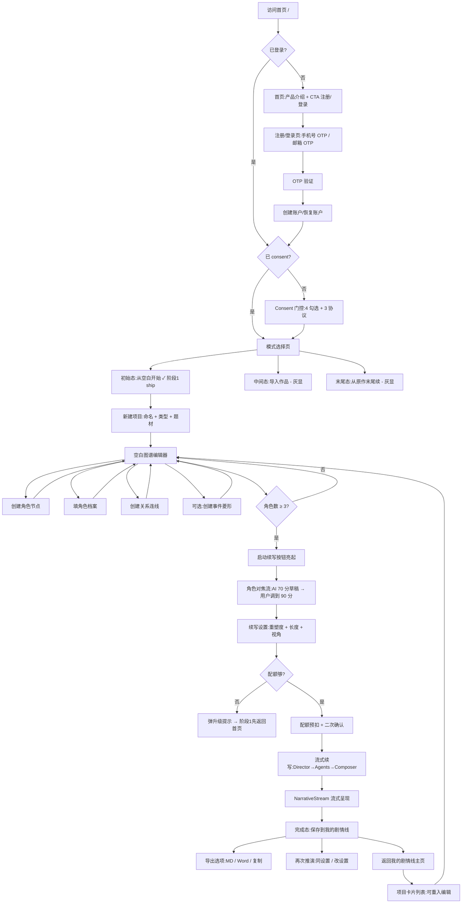

# MVP 阶段 1:初始态完整流程图

最后更新:2026-05-09 / Day 5

---

## 目标(阶段 1 验收硬指标)

> **一个未注册用户从打开浑晶首页,到导出自己第一份原创续写产物的完整闭环,全程无需任何外部工具/客服介入,且整个流程对零版权风险负责**。

数字基线:
- 全流程**新用户首跑时长 ≤ 25 分钟**(注册 3min + consent 2min + 创建项目 1min + 填 3 个角色 8min + 角色对焦 5min + 续写 + 导出 6min)
- **续写引擎单次成本 ≤ 1.5 元**(初始态没有原作 retrieval,token 量小于中间态)
- **配额闸门正确**:免费用户做完一次后第二次被拒并提示升级

---

## 整体流程(Mermaid)



---

## 9 个关键节点详解

### 节点 1 · 首页 `/`
- **目的**:把"读者意难平"的情感钩子拍在脸上,而不是讲技术
- **UI**:全屏黑底,中央一句话——"你心里有哪部作品/哪个角色,让你这么多年都放不下?" + 下方两个 CTA(登录 / 立即开始 → 走 OTP 注册)
- **数据**:无
- **复用 / 新建**:🆕 全新页面 `views/Landing.vue`
- **法务**:页脚附三协议链接(只读访问,不强制勾选)

### 节点 2 · 注册/登录 `/auth`
- **目的**:最低摩擦让用户进入系统
- **UI**:Tab 切换"手机号" / "邮箱",输入 → 发送 OTP → 输入 6 位码 → 自动注册或恢复
- **数据**:`User { id, phone?, email?, created_at, plan: 'free' }`
- **复用 / 新建**:🆕 全新页面 `views/Auth.vue` + 后端 `/auth/send_otp` `/auth/verify`
- **法务**:首次注册时记录 `register_meta` 含 IP / UA / 时间(法务追偿证据链)
- **MVP 取舍**:**不做密码体系**,只做 OTP(降低复杂度,提升首跑速度)

### 节点 3 · Consent 门控
- **目的**:首次进入强制四勾选(已年满 18 + 三协议)
- **状态**:✅ Day 4 已完成(`UploadOverlay.vue` 的 consent phase)
- **复用 / 新建**:♻️ 复用刚做的 `UploadOverlay` consent 部分,从 `UploadOverlay` 拆出独立组件 `views/Consent.vue`
- **法务**:✅ 律师 P0 改动 ③ 已对接

### 节点 4 · 模式选择 `/mode-select`
- **目的**:让用户明白浑晶不只能做"反事实",而是"四态全覆盖";即使阶段 1 只 ship 初始态,也要让另外三态可见
- **UI**:四张卡片横向排列,初始态高亮可点,其他三态灰显 + 角标"敬请期待"
- **数据**:无
- **复用 / 新建**:🆕 全新页面 `views/ModeSelect.vue`
- **法务**:无
- **设计意图**:让首次用户看到"原来这是个能做四件事的平台",而不是误以为浑晶只是"白板写作工具"

### 节点 5 · 新建项目
- **目的**:给原创作品一个最小元数据骨架
- **UI**:模态框 — 项目名(必填,≤30 字)+ 作品类型(下拉:小说/漫画分镜/番剧大纲/通用)+ 题材标签(多选 chip:玄幻/言情/历史/科幻/悬疑/校园/其他)
- **数据**:`Project { id, user_id, name, type, tags[], mode: 'initial', created_at }`
- **复用 / 新建**:🆕 `components/CreateProjectModal.vue` + 后端 `/projects POST`
- **MVP 取舍**:不做封面图、不做项目描述长文(都是写作类工具的 yak shave,先 ship 再说)

### 节点 6 · 空白图谱编辑器 `/projects/:id/graph`(**核心阶段**)
- **目的**:让用户从零搭一张知识图谱
- **UI 三层结构**:
  - **画布层**(主体 70%):3D 空间,默认 0 节点,空状态文案"右键空白处创建第一个角色 ▸"
  - **侧边工具栏**(左侧 60px):创建角色 / 创建事件 / 切换 2D-3D / 撤销 / 重做 / 保存
  - **右侧抽屉**(动态 30%):点击节点弹角色卡(复用 CharacterDrawer 但加可编辑态)
- **核心交互**:
  - **创建角色**:右键画布 → 弹"新角色"小卡 → 填姓名 → 节点出现在鼠标位置(力导向布局会重新平衡)
  - **填档案**:点节点 → 右抽屉打开 → 填身份/性格/标志性原话(可选,自由填)/雷区(可选)
  - **创建关系**:Shift + 点击两个角色 → 弹关系类型选择(亲属/敌对/朋友/情侣/师徒/同事/其他)→ 填描述 → 连线
  - **创建事件**(可选):右键画布 → "新事件" → 填事件描述 → 菱形节点出现 → 选参与角色连线
  - **改关系颜色**:点连线 → 抽屉里改类型 → 颜色自动跟随
- **数据**:
  ```
  Character { id, project_id, name, identity, personality, quotes[], no_go_list[], position{x,y,z}, color }
  Relationship { id, project_id, source_id, target_id, type, description }
  Event { id, project_id, description, participants[] }
  ```
- **复用 / 新建**:♻️ CrystalGraph 改造(增加 editable 模式)+ 🆕 工具栏 `components/EditorToolbar.vue` + 🆕 创建节点的右键菜单
- **持久化**:每次操作 debounce 800ms 自动保存到后端;离线状态降级到 localStorage
- **配额关联**:角色数上限按订阅档(免费 10 / 38 元 25 / 268 元 50)

### 节点 7 · 角色对焦流(reader's_canon_confirmation)
- **目的**:把 AI 辅助变成"对草稿的审阅"而非"从零创作",降低用户心智负担
- **触发**:用户填完 ≥3 个角色 + 准备启动续写时,弹出此流程(可跳过,但跳过会有质量警告)
- **流程**:
  1. AI 拿到用户填的全部档案,生成"补全建议"列表(每个角色 3-5 条)
     - 例:"宝玉性格里你只写了'细腻',雷区清单空。AI 建议补充:对女子粗鲁、说功名利禄相关的话、对长辈顶嘴 — 这三条要采纳吗?"
  2. UI 展示一个滚动卡片流,每条建议三个按钮:✓ 采纳 / ✕ 不采纳 / ✎ 改一改
  3. 用户处理完所有建议(预计 5 分钟内)
  4. 完成态展示:"这是你心中的[项目名]。它和别人心中的不一样。"+ 一个继续按钮
- **数据**:每条 AI 建议落 `CharacterRefinement { character_id, suggestion, action: 'accept'|'reject'|'edit', user_edit? }`
- **复用 / 新建**:🆕 全新组件 `components/CharacterFocus.vue` + 后端 `/projects/:id/refine POST`(调 LLM 出建议)
- **MVP 取舍**:**第一版不做"严格程度滑块"**(doc 5 提到的"绝对不会"vs"通常不会"),只做二元采纳/不采纳;严格度滑块留阶段 2

### 节点 8 · 续写设置 + 配额确认
- **目的**:让用户在按下"启动"前清楚知道"我会消耗多少 / 产出什么 / 失败会怎样"
- **UI**:底部 dock 升起(复用 ReshapeSlider 的视觉)
  - 重塑度滑块(初始态语义:角色行为偏离用户设定的程度,默认 60%)
  - 续写长度(下拉:5000 / 30000 / 100000 字,按订阅档限定)
  - 续写视角(下拉:全知第三人称 / 某角色第一人称)
  - 右侧:本次预计消耗"1 次完整推演 / 剩余 X 次"
- **配额校验**:
  - 配额够 → 启动按钮亮 → 二次确认弹窗"消耗 1 次配额,确认?"
  - 配额不够 → 启动按钮灰 + 提示"本月配额已用完,升级到 38 元/月可再做 3 次"
- **复用 / 新建**:♻️ ReshapeSlider 改造支持初始态参数 + 🆕 `components/QuotaConfirmModal.vue`
- **法务**:升级提示按钮跳转到订阅页(订阅前必须独立勾选《价格说明》— 律师 P0 改动 ⑤)

### 节点 9 · 流式续写 → 完成 → 导出/归档
- **目的**:让用户看到产物 → 保存 → 导出
- **流程**:
  - 启动后图谱整体暗化(复用 dimMode),Director 编排 → agents 互动 → Composer 流式输出
  - NarrativeStream 流式呈现(复用,字号大、留白多、可滚动阅读)
  - 完成后底部出现操作条:**保存到我的剧情线** / **导出**(MD / Word / 纯文本复制)/ **再次推演**(同设置 / 改设置)
- **数据**:`Generation { id, project_id, settings, narrative_text, agents_used, cost_yuan, created_at }`
- **复用 / 新建**:♻️ NarrativeStream + 🆕 `components/ExportMenu.vue` + 后端 `/projects/:id/generate POST` + `/generations/:id/export GET`
- **MVP 取舍**:**初始态不需要去 IP 化导出**(因为本来就是用户原创),把这个功能留给阶段 2 的中间态
- **持久化**:产物永久保存,即使用户取消订阅,**已生成的产物不删除**(老用户老规则,律师改动 ②)

---

## 我的剧情线主页 `/dashboard`(节点 9 后的归宿)

- **UI**:卡片列表 — 每张卡片显示项目名 / 类型 / 角色数 / 推演次数 / 最近一次产物预览首句 / 重入按钮
- **空状态**:"还没有项目?去创建第一个" + CTA → 节点 4 模式选择
- **复用 / 新建**:🆕 `views/Dashboard.vue` + 后端 `/projects GET`
- **核心动线**:登录后默认落到 dashboard(而不是 ModeSelect),让老用户秒回到自己的项目

---

## 数据模型最小集合(后端 schema)

```
User
  id, phone?, email?, plan('free'|'standard'|'super'), quota_reset_at, created_at

Subscription
  id, user_id, plan, snapshot_at(老用户老规则锚点), valid_until

Project
  id, user_id, name, type, tags[], mode('initial'), created_at, updated_at

Character
  id, project_id, name, identity, personality, quotes[], no_go_list[],
  position{x,y,z}, color, created_at, updated_at

Relationship
  id, project_id, source_id, target_id, type, description, color

Event (可选,初始态非必要)
  id, project_id, description, participants_ids[]

CharacterRefinement (角色对焦产物)
  id, character_id, suggestion_text, suggestion_kind, action, user_edit?

Generation (推演产物)
  id, project_id, settings_json, narrative_text, agents_used,
  cost_yuan, created_at

UsageLog (配额追踪)
  id, user_id, action, quota_consumed, ts

ConsentRecord (法务证据)
  id, user_id, version, checks_json, accepted_at, ip, ua
```

---

## 复用 vs 新建组件清单

### ♻️ 已有可复用(微调即可)
| 组件 | 现状 | 阶段 1 改动 |
|---|---|---|
| `UploadOverlay` consent phase | 完整 | 拆出为独立 `views/Consent.vue` |
| `CrystalGraph` | 只读 | 加 editable 模式 + 节点拖拽 + 右键菜单 |
| `CharacterDrawer` | 只读 | 加可编辑模式(身份/性格/原话/雷区都变 editable) |
| `ReshapeSlider` | 中间态参数 | 适配初始态参数集(去掉 anchorEvent / divergence) |
| `NarrativeStream` | 完整 | 不动 |
| `useSimulation` | 中间态状态机 | 加初始态启动入口 + 不预设 anchorEvent |

### 🆕 全新组件(待开发)
| 组件 | 优先级 | 备注 |
|---|---|---|
| `views/Landing.vue` | P1 | 首页钩子 |
| `views/Auth.vue` | P0 | OTP 登录 |
| `views/Consent.vue` | P0 | 从 UploadOverlay 拆出 |
| `views/ModeSelect.vue` | P1 | 模式选择,3 态灰显 |
| `views/Dashboard.vue` | P0 | 我的剧情线 |
| `views/ProjectGraph.vue` | P0 | 包裹 CrystalGraph 的编辑器外壳 |
| `components/CreateProjectModal.vue` | P0 | 新建项目 |
| `components/EditorToolbar.vue` | P0 | 编辑器左侧工具栏 |
| `components/NodeCreatorMenu.vue` | P0 | 右键创建菜单 |
| `components/CharacterFocus.vue` | P0 | 角色对焦流(★ 灵魂组件) |
| `components/QuotaConfirmModal.vue` | P0 | 配额二次确认 |
| `components/ExportMenu.vue` | P1 | 导出 MD/Word |
| `views/Subscribe.vue` | P1 | 订阅页(独立勾价格说明) |

### 🆕 后端工程(基本是从零)
| 模块 | 说明 |
|---|---|
| FastAPI 工程脚手架 | 路由 / 中间件 / 配额拦截器 / 错误处理 |
| Auth 模块 | OTP 发送 + 验证 + JWT |
| Projects CRUD | 项目 / 角色 / 关系 / 事件的增删改查 |
| Generation 服务 | 接 simulate.py 的逻辑改造为长服务进程 |
| Quota 服务 | 配额翻译 + 预扣 + 失败回滚 |
| Storage | SQLite 单机起步;PostgreSQL 留给阶段 3 |

---

## simulate.py 改造点(初始态适配)

当前 `simulate.py` 是为中间态(红楼梦 ch74)硬编码的:
- 假设有 `anchor_event` + `divergence_text`
- 加载固定的 `ch74.json` 图谱
- 加载 `data/characters/*.json` 5 主角档案

初始态需要参数化:
1. **入口签名变更**:`simulate(project_id, generation_settings)` 而非 `simulate(chapter_id, divergence)`
2. **不再有 anchor_event** → Director 的"反事实变量自检"铁律 8 改为"用户世界规则自洽性自检"
3. **没有 voice_fingerprint** → Composer 不能用原作 quote 做 retrieval,改为"使用用户填的 quotes 数组(可能为空)+ 角色 personality 描述"
4. **正典守护者改为自洽守护者**:不审"是否违反原作",而审"是否违反用户自己设的规则"
5. **成本预估**:初始态没有大段原文 retrieval,token 预算可降到 ch74 的 30%(估 ~0.5 元/次,远低于 1.5 元上限)

---

## 法务关键节点标注

| 节点 | 法务事项 | 状态 |
|---|---|---|
| Auth(节点 2) | 注册元信息留档(IP/UA/时间) | 🆕 待做 |
| Consent(节点 3) | 4 勾选 + localStorage 持久化 | ✅ Day 4 已做 |
| 配额确认(节点 8) | 升级跳订阅页 → 订阅页独立勾价格说明 | 🆕 待做(改动 ⑤) |
| Generation(节点 9) | 不存档原文(初始态本来就没原文) | ✅ 天然合规 |
| Generation 产物(节点 9) | 永久保存,老用户老规则 | 🆕 后端逻辑(改动 ②) |
| 全局拦截 | 红旗指纹库 + 关键词拦截 | 🆕 待做(改动 ①) |

---

## 阶段 1 验收硬指标(任一不达标即停)

1. **闭环跑通**:陌生人能在 25 分钟内独立完成首跑(注册→consent→建项目→填 3 角色→对焦→续写→导出)
2. **配额闸门正确**:免费用户做完 1 次后第二次被拒,提示文案准确
3. **续写质量底线**:对填了 3 个角色 + 简单关系的项目,生成的 5000 字 narrative 至少 2/4 评估维度过 4 分(沿用 V5 的横评方法)
4. **法务节点全打**:6 项法务关键节点(上表)全部打钩
5. **稳定性**:连续 100 次续写无后端 OOM / 无前端白屏

---

## 开工建议(从哪个组件先动手)

**推荐顺序(避免依赖倒置)**:

```
Week 1:后端骨架 + 前端账户层
  Day 1-2  FastAPI 脚手架 + SQLite + User/Project/Character 三个表
  Day 3-4  Auth(OTP 发送 + 验证) + 前端 Auth.vue
  Day 5    Consent.vue 拆出 + Dashboard.vue 空版

Week 2:图谱编辑器(核心)
  Day 1-2  CrystalGraph editable 模式 + EditorToolbar + 节点创建
  Day 3-4  CharacterDrawer 可编辑模式 + 关系连线创建
  Day 5    持久化(debounce 自动保存 + 离线降级)

Week 3:角色对焦 + 续写引擎
  Day 1-2  simulate.py 参数化改造 + 自洽守护者 prompt
  Day 3-4  CharacterFocus.vue(★)
  Day 5    QuotaConfirmModal + 续写设置 dock

Week 4:导出 + 验收 + 部署
  Day 1-2  ExportMenu.vue + 配额计费正确性测试
  Day 3    陌生人首跑彩排(找 3 个非技术朋友)
  Day 4-5  公网部署(域名/备案/证书/监控)+ 阶段 1 验收
```

**第一行代码建议从 FastAPI 脚手架开始**,因为前端所有交互都依赖后端 API 的契约。

**最高风险点**:
- ★ 角色对焦流(全新交互,LLM 提示词 + 用户体验都是未验证)— 已单独出设计文档 `docs/MVP阶段1_角色对焦组件设计.md`
- ~~CrystalGraph editable 模式(3d-force-graph 对动态节点增删的支持)~~ — 已确认无问题(2026-05-09)
- ★ OTP 短信成本(国内 OTP 短信单条 0.04-0.08 元,初期可用阿里云试用额度,预算要算)

---

## 与四态长期路线的衔接

阶段 1 ship 后,**初始态的所有组件都会被中间态/末尾态/周期态复用**:
- 图谱编辑器 → 中间态用同一个组件,只是数据是 import 来的而非用户填的
- 角色对焦 → 中间态时,AI 草稿来自原作 voice_fingerprint,而非凭空猜测
- 续写设置 dock → 中间态加 anchor_event 选择 + divergence 输入框
- 我的剧情线 → 周期态的产物累积也走这里

**所以阶段 1 不只是"先 ship 一个最简化版本",而是"为四态搭好通用骨架"**。组件设计时要预留接口,避免阶段 2 大改。
